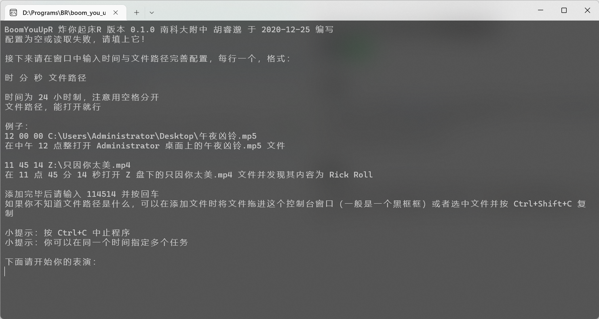
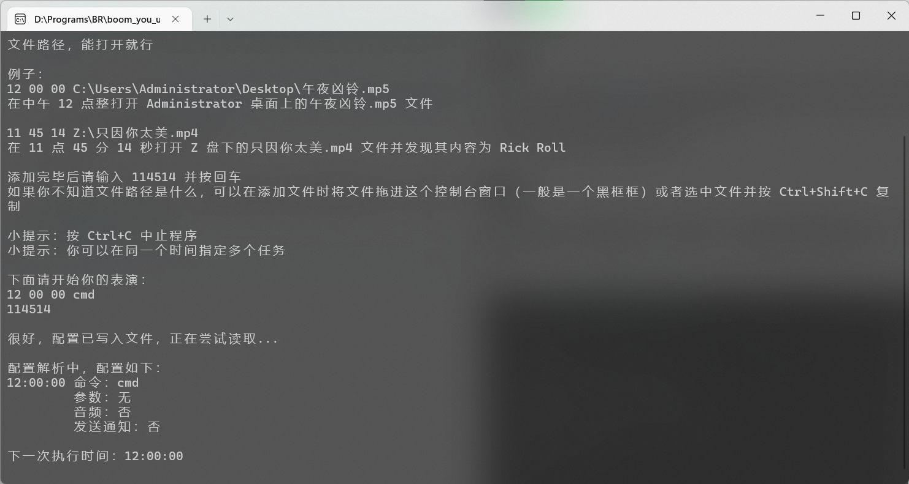
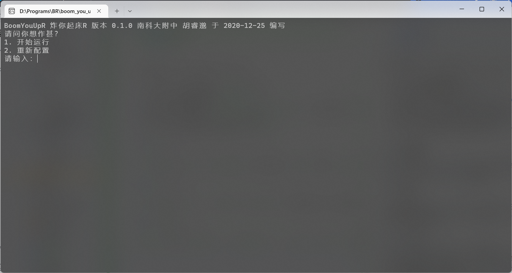
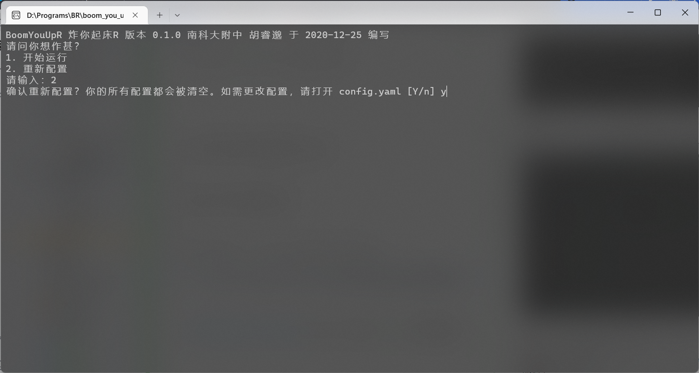
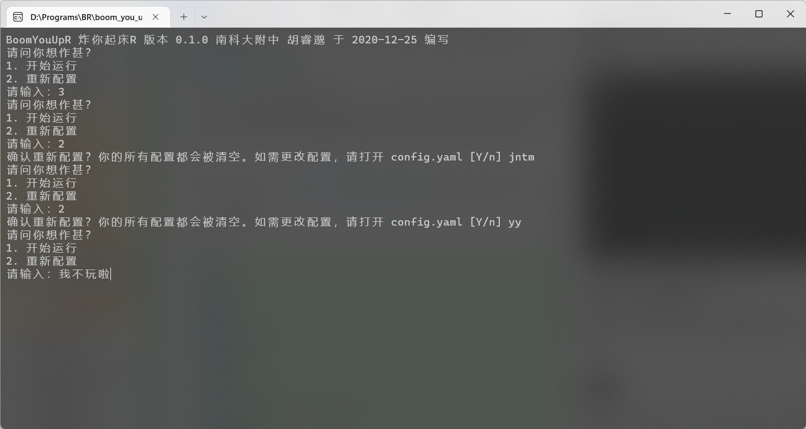
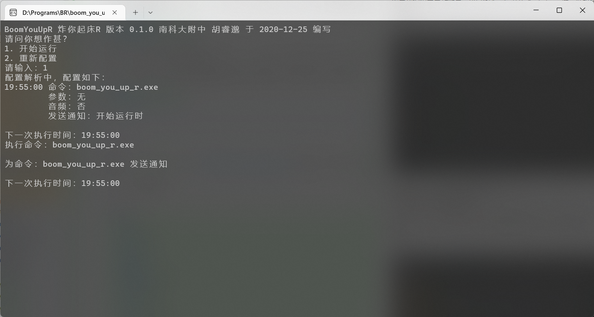
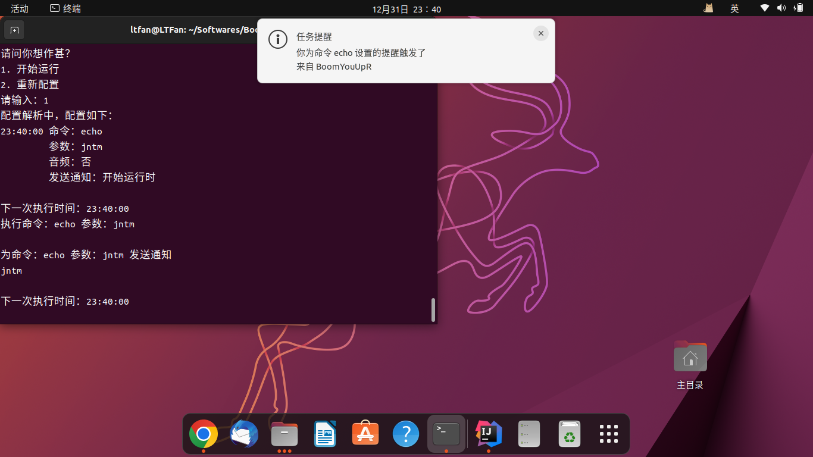

# BoomYouUpR 炸你起床R

[](https://www.gnu.org/licenses/gpl-3.0.html) [](https://github.com/xfqwdsj/BoomYouUpR/actions/workflows/build.yaml) 

## 介绍

`R -> Rust` ，本项目为 [BoomYouUp](https://github.com/xfqwdsj/BoomYouUp) 用 Rust 语言重新编写的版本。该版本相对原始版本支持了音频播放。~~绝对不是因为我不会设置 C++ 库。~~

本程序可以通过配置执行简单的自动任务。

## 用法

首次运行程序，可以通过交互式命令行进行配置。也可以通过拷贝或编辑工作目录（一般情况下为程序目录）下的配置文件 `config.yaml` （未来将支持载入不同配置）进行配置。



根据提示，我们想要指定在 12:00:00 执行 `cmd` 命令，可以输入如下内容：

```
12 00 00 cmd
114514
```

按下 <kbd>Enter</kbd> 键后，程序将会自动写入配置并进入运行状态。



若配置文件已经存在，启动程序时，程序会询问我们想执行的操作。



按照提示，如果我们想开始运行程序，可以输入 `1` 并按下 <kbd>Enter</kbd> 键。

如果我们想要重新配置，可以输入 `2` 并按下 <kbd>Enter</kbd> 键。此时程序会再次询问是否想重新配置。



按照提示，如果我们确实想重新配置，可以输入 `y` 并按下 <kbd>Enter</kbd> 键，此时程序将重新引导我们进行交互式配置。

请注意，我们在选择操作和确认重新配置时输入错误的值会让我们重新进入选择操作状态：



如果我们尝试使用这样的配置文件，程序将会在 19:55:00 发送一条通知并启动 `boom_you_up_r.exe` ：

```yaml
- time:
    hour: 19
    minute: 55
    second: 0
  commands:
  - command: boom_you_up_r.exe
    parameters: ''
    audio: false
    notify: 0
```

这是通知在 Windows 11 上的效果：


请注意，由于 Windows 系统的限制，没有在操作系统中注册的程序无法以自己的“身份”发送通知，故本程序“借用”了 `Windows PowerShell` 的“身份”发送通知。

这是程序运行时的效果：



BoomYouUpR 在 2022 年的最后一天（12-31）支持了 Linux 系统，这是程序在 Ubuntu 22.10 和 GNOME 43.1 上的效果：



## 配置

配置文件 `config.yaml` 为 [YAML](https://yaml.org) 格式，由一个接受 `Item` 对象的数组组成。

以下为一个示例配置：

```yaml
- time:
    hour: 18
    minute: 0
    second: 0
  commands:
  - command: 1.mp3
    parameters: ''
    audio: true
    notify: 0
  - command: ffplay
    parameters: -i 1.mp3 -autoexit
    audio: false
    notify: -1
- time:
    hour: 19
    minute: 0
    second: 0
  commands:
  - command: 2.mp3
    parameters: ''
    audio: false
    notify: 10
```

在这个配置文件中，我们实际上定义了五个任务：

1. 在 18:00:00 发送播放音频 `1.mp3` 的通知
2. 在 18:00:00 播放音频文件 `1.mp3`
3. 在 18:00:00 执行命令 `ffplay -i 1.mp3 -autoexit` ，实际上是使用 `ffplay` 播放音频文件 `1.mp3` 并在播放结束后自动退出 `ffplay`
4. 在 18:59:50 发送打开文件 `2.mp3` 的通知
5. 在 19:00:00 使用系统中合适的程序打开 `2.mp3`

### `Item` 对象

`Item` 对象由 `time` 和 `commands` 两个字段组成。 `time` 字段为 `Time` 对象， `commands` 字段为 `Command` 对象的数组。

#### `Time` 对象

`Time` 对象由 `hour` 、 `minute` 和 `second` 三个字段组成。这三个字段均为允许表示对应数值的非负整数类型 `u8` ，分别表示时、分、秒。

#### `Command` 对象

`Command` 对象由 `command` 、 `parameters` 、 `audio` 和 `notify` 四个字段组成。 `command` 字段为 `String` 类型，表示要执行的命令。 `parameters` 字段为 `String` 类型，表示要传递给命令的参数（当 `audio` 为 `true` ，即使用内置播放器播放音频时，本字段将被忽略）。 `audio` 字段为 `bool` 类型，表示是否使用内置播放器播放音频。 `notify` 字段为 `isize` 类型，表示是否发送通知。当 `notify` 为非负整数时，表示发送通知提前的时间（单位为秒）；当其为 `-1` 时，表示不发送通知；在程序内部，其有可能会被指定为 `-2` ，表示该任务为发送通知（用户无需手动指定该值，这个过程将会自动执行）。

## 许可

本项目使用 [GNU General Public License v3.0](https://www.gnu.org/licenses/gpl-3.0.html) 开源许可证授权给你，使用本项目前请确保你已经阅读、理解、接受并保证遵守该许可证。
